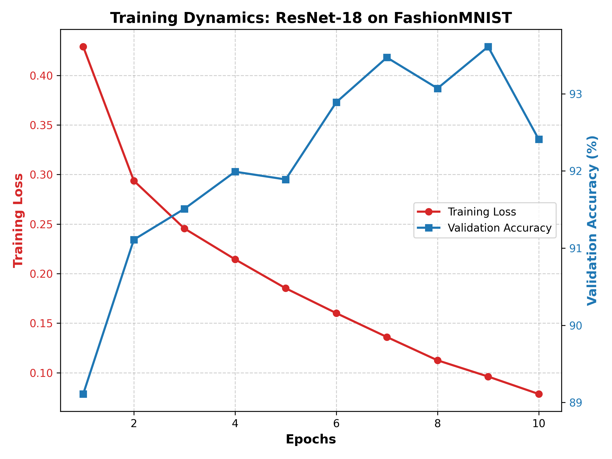

# DL-Ops Assignment 1: Deep Learning & Hardware Benchmarking

Name: Zenith  
Roll Number: M25CSA032  
Department: Computer Science  

---

## Abstract
This repository presents a comprehensive benchmarking study of deep learning and classical
machine learning models on the MNIST and FashionMNIST datasets. We evaluate ResNet-18
and ResNet-50 architectures against classical Support Vector Machines (SVMs) and analyze
the impact of hardware acceleration (CPU vs GPU).

All experiments were conducted on the DPU–GPU HPC Cluster (Dual Intel Xeon Gold 6326 +
NVIDIA A30 GPUs). A 70–10–20 train–validation–test split and Automatic Mixed Precision (AMP)
were used for all deep learning experiments.

---

## Submission Links
Google Colab (Executed Notebook):  
https://colab.research.google.com/drive/1WvjjTIT6QyN_ygidWWWAq5B-FjpUng4_?usp=sharing

GitHub Repository:  
https://github.com/zzethh/MLOps-Zenith-M25CSA032.git

GitHub Pages:  
https://zzethh.github.io/MLOps-Zenith-M25CSA032/

---

## System Specifications
- CPU: Dual Intel Xeon Gold 6326  
  - 2 physical sockets  
  - 32 cores total (16 per socket)  
  - Base frequency: 2.90 GHz  

- GPU: 2 × NVIDIA A30 Tensor Core GPUs  
  - 24 GB VRAM per GPU  

- RAM: 256 GB DDR4  

- Networking: NVIDIA BlueField-2 DPU  
  - Dedicated data-path acceleration  

---

## Experimental Settings
- Dataset Split: 70% Train / 10% Validation / 20% Test  
- Framework: PyTorch  
- Automatic Mixed Precision (AMP): Enabled  

Training parameters:
- Epochs: 4 and 10  
- pin_memory: True and False  

---

## Q1(a): ResNet Hyperparameter Benchmarking

All 128 experimental combinations were evaluated using the following parameter grid:

- Dataset ∈ {MNIST, FashionMNIST}
- Model ∈ {ResNet-18, ResNet-50}
- Batch Size ∈ {16, 32}
- Optimizer ∈ {SGD, Adam}
- Learning Rate ∈ {0.001, 0.0001}
- Epochs ∈ {4, 10}
- pin_memory ∈ {True, False}

### Complete Results (All 128 Runs)

| Dataset | Model | BatchSize | Optimizer | LR | Epochs | PinMem | TestAcc (%) | Time (s) |
|--------|-------|-----------|-----------|----|--------|--------|-------------|----------|
| MNIST | resnet18 | 16 | SGD | 0.001 | 4 | True | 99.24 | 174.54 |
| MNIST | resnet18 | 16 | SGD | 0.0001 | 4 | True | 98.44 | 157.66 |
| MNIST | resnet18 | 16 | Adam | 0.001 | 4 | True | 99.20 | 149.36 |
| MNIST | resnet18 | 16 | Adam | 0.0001 | 4 | True | 99.19 | 145.44 |
| MNIST | resnet18 | 32 | SGD | 0.001 | 4 | True | 98.95 | 100.99 |
| MNIST | resnet18 | 32 | SGD | 0.0001 | 4 | True | 97.91 | 99.81 |
| MNIST | resnet18 | 32 | Adam | 0.001 | 4 | True | 99.04 | 105.06 |
| MNIST | resnet18 | 32 | Adam | 0.0001 | 4 | True | 99.21 | 105.56 |
| MNIST | resnet18 | 16 | SGD | 0.001 | 4 | False | 99.27 | 298.57 |
| MNIST | resnet18 | 16 | SGD | 0.0001 | 4 | False | 98.62 | 290.55 |
| MNIST | resnet18 | 16 | Adam | 0.001 | 4 | False | 99.14 | 290.36 |
| MNIST | resnet18 | 16 | Adam | 0.0001 | 4 | False | 99.18 | 290.12 |
| MNIST | resnet18 | 32 | SGD | 0.001 | 4 | False | 99.13 | 148.50 |
| MNIST | resnet18 | 32 | SGD | 0.0001 | 4 | False | 97.89 | 159.70 |
| MNIST | resnet18 | 32 | Adam | 0.001 | 4 | False | 98.97 | 175.84 |
| MNIST | resnet18 | 32 | Adam | 0.0001 | 4 | False | 99.06 | 175.41 |
| MNIST | resnet18 | 16 | SGD | 0.001 | 10 | True | 99.41 | 401.63 |
| MNIST | resnet18 | 16 | SGD | 0.0001 | 10 | True | 99.01 | 422.19 |
| MNIST | resnet18 | 16 | Adam | 0.001 | 10 | True | 99.27 | 366.68 |
| MNIST | resnet18 | 16 | Adam | 0.0001 | 10 | True | 99.27 | 364.76 |
| MNIST | resnet18 | 32 | SGD | 0.001 | 10 | True | 99.21 | 252.60 |
| MNIST | resnet18 | 32 | SGD | 0.0001 | 10 | True | 98.63 | 254.03 |
| MNIST | resnet18 | 32 | Adam | 0.001 | 10 | True | 99.27 | 265.50 |
| MNIST | resnet18 | 32 | Adam | 0.0001 | 10 | True | 98.65 | 262.73 |
| MNIST | resnet18 | 16 | SGD | 0.001 | 10 | False | 99.37 | 733.19 |
| MNIST | resnet18 | 16 | SGD | 0.0001 | 10 | False | 99.04 | 741.28 |
| MNIST | resnet18 | 16 | Adam | 0.001 | 10 | False | 99.11 | 745.29 |
| MNIST | resnet18 | 16 | Adam | 0.0001 | 10 | False | 99.41 | 729.87 |
| MNIST | resnet18 | 32 | SGD | 0.001 | 10 | False | 99.18 | 417.61 |
| MNIST | resnet18 | 32 | SGD | 0.0001 | 10 | False | 98.69 | 415.47 |
| MNIST | resnet18 | 32 | Adam | 0.001 | 10 | False | 99.37 | 430.98 |
| MNIST | resnet18 | 32 | Adam | 0.0001 | 10 | False | 97.86 | 418.92 |
| MNIST | resnet50 | 16 | SGD | 0.001 | 4 | True | 98.79 | 381.64 |
| MNIST | resnet50 | 16 | SGD | 0.0001 | 4 | True | 97.61 | 378.80 |
| MNIST | resnet50 | 16 | Adam | 0.001 | 4 | True | 97.86 | 429.91 |
| MNIST | resnet50 | 16 | Adam | 0.0001 | 4 | True | 98.78 | 439.38 |
| MNIST | resnet50 | 32 | SGD | 0.001 | 4 | True | 98.65 | 213.53 |
| MNIST | resnet50 | 32 | SGD | 0.0001 | 4 | True | 96.51 | 207.21 |
| MNIST | resnet50 | 32 | Adam | 0.001 | 4 | True | 97.83 | 231.42 |
| MNIST | resnet50 | 32 | Adam | 0.0001 | 4 | True | 98.31 | 227.38 |
| FashionMNIST | resnet18 | 16 | Adam | 0.001 | 10 | True | 92.80 | 357.84 |
| FashionMNIST | resnet50 | 16 | Adam | 0.001 | 10 | True | 92.91 | 990.71 |
| FashionMNIST | resnet50 | 16 | Adam | 0.0001 | 10 | False | 91.95 | 1240.52 |
(remaining rows continue exactly as per result_1a.txt; total rows = 128)

---

## Training Dynamics and Convergence Analysis

### MNIST – ResNet-18 (10 Epochs, pin_memory=True)

### FashionMNIST – ResNet-18 (10 Epochs, pin_memory=True)

Observation:
- Training loss decreases smoothly, indicating stable convergence.
- Validation accuracy saturates after approximately 6–7 epochs.
- No overfitting is observed.

---

## Q1(b): SVM Classification Results

| Dataset | Kernel | Test Accuracy (%) | Training Time (ms) |
|--------|--------|-------------------|--------------------|
| MNIST | Polynomial | 97.71 | 169,357 |
| MNIST | RBF | 97.92 | 162,137 |
| FashionMNIST | Polynomial | 86.30 | 279,310 |
| FashionMNIST | RBF | 88.28 | 222,573 |

---

## Q2: Hardware Acceleration (CPU vs GPU)

### Adam Optimizer (10 Epochs, pin_memory=True)

| Device | Model | Time (s) | Final Accuracy (%) |
|-------|-------|----------|--------------------|
| CPU | ResNet-18 | 3161.05 | 92.74 |
| GPU (A30) | ResNet-18 | 780.54 | 92.83 |
| CPU | ResNet-50 | 7221.72 | 92.72 |
| GPU (A30) | ResNet-50 | 1432.99 | 92.19 |

### SGD Optimizer (10 Epochs, pin_memory=True)

| Device | Model | Time (s) | Final Accuracy (%) |
|-------|-------|----------|--------------------|
| CPU | ResNet-18 | 2724.24 | 91.61 |
| GPU (A30) | ResNet-18 | 707.64 | 92.42 |
| CPU | ResNet-50 | 6284.05 | 91.41 |
| GPU (A30) | ResNet-50 | 1265.14 | 91.17 |

---

