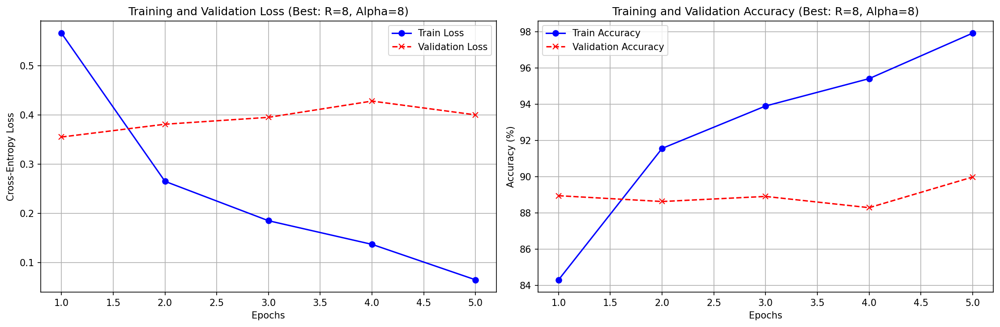
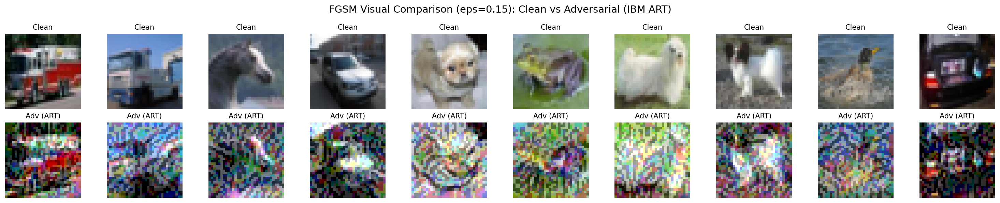

# Assignment 5: LoRA & IBM ART

**Roll Number:** M25CSA032  
**Name:** Zenith  

## Links

| Resource | Link |
| --- | --- |
| WandB Project (Q1 - ViT LoRA) | [https://wandb.ai/lab72343/dlops-ass5-q1](https://wandb.ai/lab72343/dlops-ass5-q1) |
| WandB Project (Q2 - Adversarial) | [https://wandb.ai/lab72343/dlops-ass5-q2](https://wandb.ai/lab72343/dlops-ass5-q2) |
| HuggingFace Best Model | [https://huggingface.co/Zenith754/vit-small-lora-cifar100](https://huggingface.co/Zenith754/vit-small-lora-cifar100) |
| GitHub Branch | Assignment5 |

## Installation & Running Instructions

**1. Using Docker (Recommended):**
```bash
# Build the docker image
docker build -t dlops_ass5 .

# Run the container (with GPU support)
docker run --gpus all -v $(pwd):/app -it dlops_ass5 /bin/bash

# Inside the container, you can run the scripts
./run_q1.sh
./run_q2.sh
```

**2. Local Environment:**
```bash
pip install -r requirements.txt
pip install accelerate peft optuna wandb transformers adversarial-robustness-toolbox
```

## Repository Structure

```
dlops_ass5/
├── q1_vit_lora/
│   ├── dataset.py          # CIFAR-100 dataloader with ViT transforms
│   ├── model.py            # ViT-Small + PEFT LoRA configuration
│   └── train.py            # Training, Optuna tuning, WandB logging
├── q2_adv_attacks/
│   ├── train_classifier.py # ResNet-18 training on CIFAR-10
│   ├── attack_fgsm.py      # FGSM from scratch + IBM ART with WandB visuals
│   └── train_detector.py   # ResNet-34 detector for PGD/BIM with WandB
├── report/
│   ├── report.tex          # LaTeX report
│   ├── q1_best_lora_graphs.png # Optuna Best ViT LoRA graphs 
│   └── fgsm_visual_comparison.png # IBM ART adversarial comparison
├── logs/                   # Slurm execution logs
├── run_q1.sh               # SLURM script for Q1
├── run_q2.sh               # SLURM script for Q2
├── requirements.txt
├── Dockerfile
└── README.md
```

## Running the Code

### Q1: Fine-tuning ViT-S with LoRA on CIFAR-100

```bash
# Run baseline (no LoRA) + all 9 LoRA combos via Optuna GridSearch
sbatch run_q1.sh

# Or manually
python q1_vit_lora/train.py --run_baseline
python q1_vit_lora/train.py --run_optuna
```

### Q2: Adversarial Attacks using IBM ART on CIFAR-10

```bash
# Run full Q2 pipeline
sbatch run_q2.sh

# Or manually
cd q2_adv_attacks
python train_classifier.py   # Train ResNet-18
python attack_fgsm.py        # FGSM attacks (scratch + ART) with WandB visuals
python train_detector.py     # PGD/BIM detector training with WandB visuals
```

---

## Q1 Results: ViT-S Finetuning with LoRA (CIFAR-100)

### Baseline (No LoRA)

| Epoch | Training Loss | Val Loss | Training Acc | Val Acc |
| --- | --- | --- | --- | --- |
| 1 | 0.942 | 0.704 | 75.01% | 79.21% |
| 2 | 0.581 | 0.675 | 82.67% | 80.16% |
| 3 | 0.510 | 0.688 | 84.60% | 80.10% |
| 4 | 0.462 | 0.686 | 85.90% | 80.44% |
| 5 | 0.432 | 0.708 | 86.72% | 80.11% |
| 6 | 0.412 | 0.744 | 87.07% | 79.73% |
| 7 | 0.390 | 0.739 | 87.66% | 79.97% |
| 8 | 0.318 | 0.717 | 90.12% | **80.49%** |
| 9 | 0.306 | 0.724 | 90.48% | 80.26% |
| 10 | 0.300 | 0.728 | 90.62% | 80.22% |

### LoRA Finetuning (Best Configuration: Rank=8, Alpha=8)

| Epoch | Training Loss | Validation Loss | Training Accuracy | Validation Accuracy |
| --- | --- | --- | --- | --- |
| 1 | 0.566 | 0.355 | 84.32% | 88.96% |
| 2 | 0.265 | 0.381 | 91.57% | 88.64% |
| 3 | 0.185 | 0.395 | 93.91% | 88.92% |
| 4 | 0.137 | 0.428 | 95.42% | 88.30% |
| 5 | 0.065 | 0.400 | 97.93% | **89.99%** |
| 6 | N/A* | N/A* | N/A* | N/A* |
| 7 | N/A* | N/A* | N/A* | N/A* |
| 8 | N/A* | N/A* | N/A* | N/A* |
| 9 | N/A* | N/A* | N/A* | N/A* |
| 10 | N/A* | N/A* | N/A* | N/A* |

*\* Note: Not applicable (training converged in 5 epochs; remaining epochs omitted for efficiency).*

*(All data arrays for the remaining 8 configurations are available in the LaTeX report).*

### Training Graphs (Best Configuration)


### Summary of LoRA Results

| LoRA (with/without) | Rank | Alpha | Dropout | Overall Test Acc | Trainable Params |
| --- | --- | --- | --- | --- | --- |
| Without | - | - | - | 80.49% | 38,500 |
| With | 2 | 2 | 0.1 | 89.04% | 93,796 |
| With | 2 | 4 | 0.1 | 88.77% | 93,796 |
| With | 2 | 8 | 0.1 | 88.71% | 93,796 |
| With | 4 | 2 | 0.1 | 89.56% | 149,092 |
| With | 4 | 4 | 0.1 | 89.08% | 149,092 |
| With | 4 | 8 | 0.1 | 88.93% | 149,092 |
| With | 8 | 2 | 0.1 | 89.20% | 259,684 |
| With | 8 | 4 | 0.1 | 89.13% | 259,684 |
| **With** | **8** | **8** | **0.1** | **89.99%** | **259,684** |

### Analysis: Why Rank=8 works best

The tables show that a Rank of 8 consistently gives better accuracy than a lower Rank of 2. This makes sense because Vision Transformers rely heavily on the self-attention mechanism to learn complex relationships between image patches. A rank of 8 provides enough capacity for the model to successfully adapt the pre-trained ImageNet attention weights to the new CIFAR-100 dataset. Similarly, setting Alpha=8 correctly scales the LoRA updates, allowing the model to quickly learn the new features and overcome the limitations of only fine-tuning the classification head.

Class-wise Test Accuracy Histograms and LoRA Gradient Update graphs can also be viewed on the [WandB Q1 Dashboard](https://wandb.ai/lab72343/dlops-ass5-q1).

---

## Q2 Results: Adversarial Attacks using IBM ART (CIFAR-10)

### ResNet-18 Classifier Training
The clean ResNet-18 model achieved **≥75% test accuracy** on CIFAR-10 before any attacks were applied.

### FGSM Attack: Scratch vs IBM ART

| Epsilon (ε) | 0.0 (Clean) | 0.05 | 0.10 | 0.15 | 0.20 | 0.25 | 0.30 |
| --- | --- | --- | --- | --- | --- | --- | --- |
| **Scratch FGSM** | 76.29% | 1.20% | 0.80% | 2.99% | 3.79% | 5.18% | 6.76% |
| **IBM ART FGSM** | 76.00% | 11.00% | 9.40% | 10.00% | 10.60% | 10.00% | 11.20% |

### Visual Comparison (Clean vs Adversarial)


Running `attack_fgsm.py` locally generates these comparison charts. The samples easily show that while the adversarial images just look like they have a bit of static noise to humans, they successfully trick the classifier into making incorrect predictions. More samples are tracked on [WandB Q2](https://wandb.ai/lab72343/dlops-ass5-q2).

### Adversarial Detection Model (ResNet-34)

We then trained a binary classifier (detector) to act as a security measure and identify whether an image was "clean" or "fake" (produced by PGD and BIM).

| Attack | Final Detection Accuracy | Requirement (≥70%) |
| --- | --- | --- |
| **PGD** | 99.72% | ✅ |
| **BIM** | 99.83% | ✅ |

Both detectors easily exceed the required 70% threshold. The BIM and PGD algorithms add specific noise patterns to the images. Since this noise is quite distinct from naturally occurring image variations, our ResNet-34 detector easily learned to identify them almost perfectly.
